# Introdução

Informações básicas do projeto.

* **Projeto:** BuyArt
* **Repositório GitHub:** [https://github.com/ICEI-PUC-Minas-CC-TI/pbh-cc-2024-2-ti1-ti-artes-digitais.git](https://github.com/ICEI-PUC-Minas-CC-TI/pbh-cc-2024-2-ti1-ti-artes-digitais.git)
* **Membros da equipe:**
  * [Raphael Grossi](https://github.com/HGonroy)
  * [Miguel Pessoa](https://github.com/MiguelPessoaLF)
  * [Gabriel Anderson](https://github.com/gonafritas)
  * [Artur Fernandes](https://github.com/artur70152)

A documentação do projeto é estruturada da seguinte forma:

1. Introdução  
2. Contexto  
3. Product Discovery  
4. Product Design  
5. Metodologia  
6. Solução  
7. Referências Bibliográficas

✅ [Documentação de Design Thinking (MIRO)](files/ti_documentacao.pdf)

# Contexto

Detalhes sobre o espaço de problema, os objetivos do projeto, sua justificativa e público-alvo.

## Problema

O problema que o BuyArt busca resolver é a visibilidade dos artistas e a valorização do seu trabalho na internet.

## Objetivos

O BuyArt conecta a comunidade de diferentes maneiras, abrangendo:

- Usuários de redes sociais.
- Artistas que buscam visibilidade.
- Entusiastas que procuram trabalhos personalizados e de qualidade.

## Justificativa

Escolhemos este projeto pois sentimos a necessidade de ajudar pessoas talentosas a exercerem sua profissão de artista por meio do melhor canal de comunicação que existe: a internet.

## Público-Alvo

Artistas, usuários interessados em arte, empresas de jogos, etc.

# Product Discovery

## Etapa de Entendimento

* Matriz CSD  
* Mapa de stakeholders  
* Entrevistas qualitativas  
* Highlights de pesquisa  

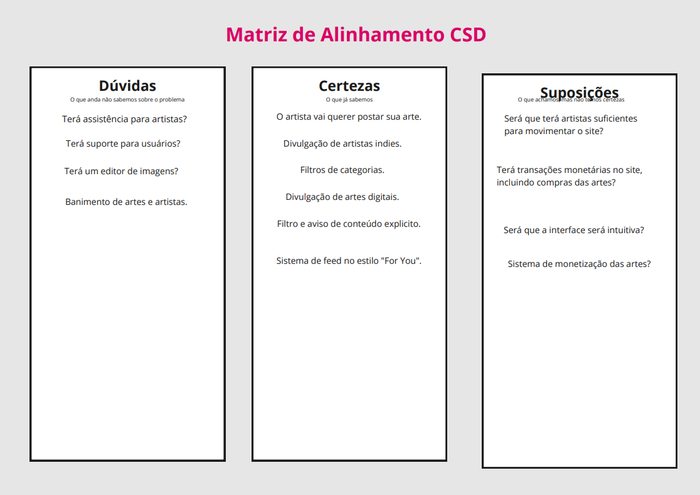
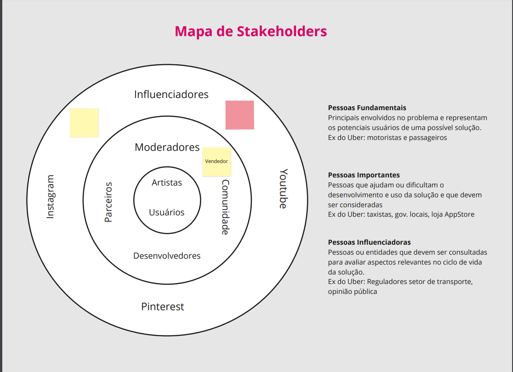
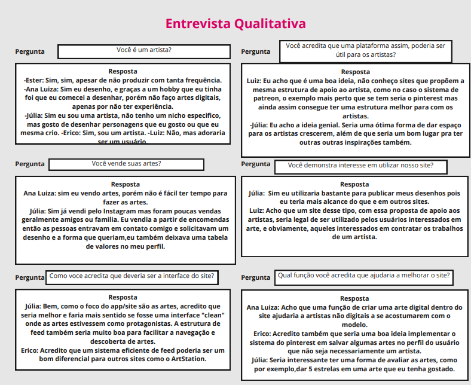
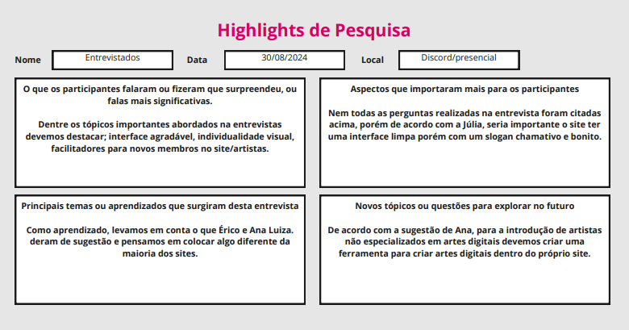

## Etapa de Definição

### Personas


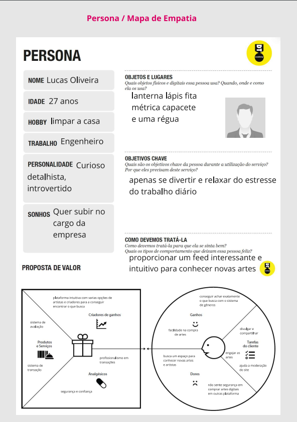
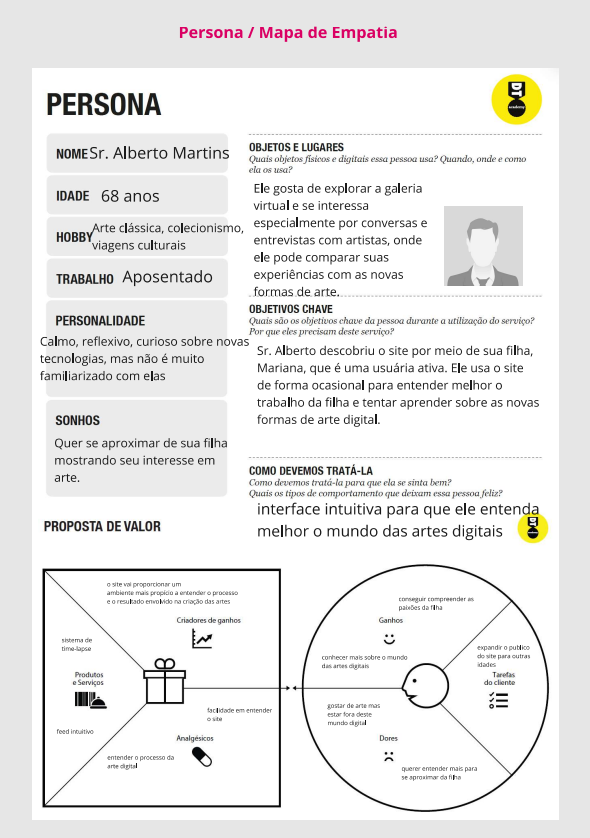

# Product Design

Essa fase envolve a definição de uma proposta de valor e a criação de wireframes, mockups e protótipos de alta fidelidade.

## Histórias de Usuários

| EU COMO...`PERSONA`  | QUERO/PRECISO ...`FUNCIONALIDADE`                        | PARA ...`MOTIVO/VALOR`                  |
|----------------------|--------------------------------------------------------|-----------------------------------------|
| Artista              | Desenhar e postar                                     | Lucrar com isso                         |
| Usuário do sistema   | Postar artes e fomentar a comunidade                  | Ser reconhecido e lucrar com isso       |
| Administrador        | Gerenciar e moderar a rede social BuyArt              | Manter a ordem e harmonia no site       |

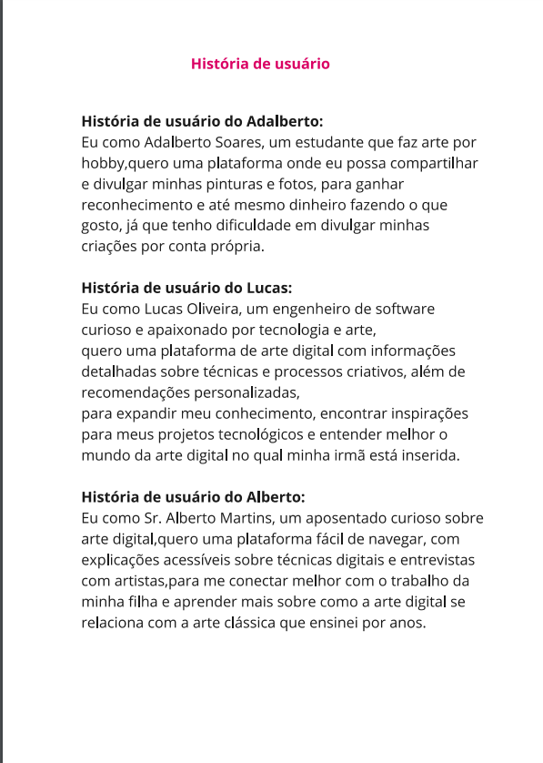

## Proposta de Valor


## Requisitos

### Requisitos Funcionais

| ID     | Descrição do Requisito                                                                 | Prioridade |
|--------|-----------------------------------------------------------------------------------------|------------|
| RF-001 | Permitir que o usuário acesse a rede social e navegue livremente em sua própria conta. | ALTA       |
| RF-002 | Possibilitar o envio de mensagens e comentários sobre as artes.                        | MÉDIA      |

### Requisitos Não Funcionais

| ID      | Descrição do Requisito                                      | Prioridade |
|---------|-------------------------------------------------------------|------------|
| RNF-001 | O sistema deve ser responsivo para rodar em dispositivos móveis. | MÉDIA      |
| RNF-002 | Deve processar requisições do usuário em no máximo 3 segundos. | BAIXA      |

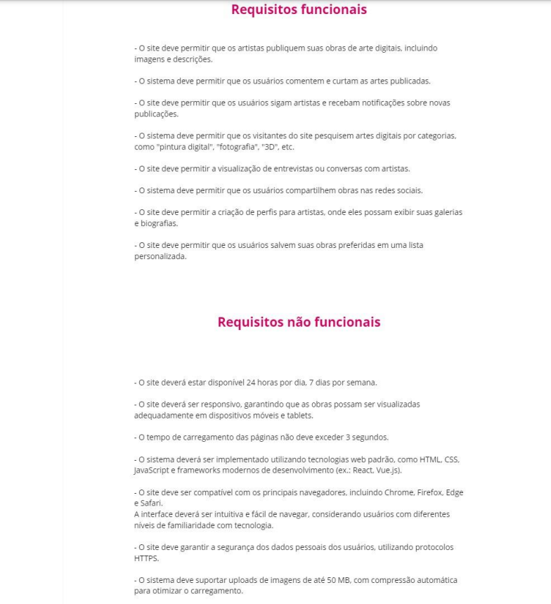

# Projeto de Interface

Artefatos relacionados à interface e interação do usuário.


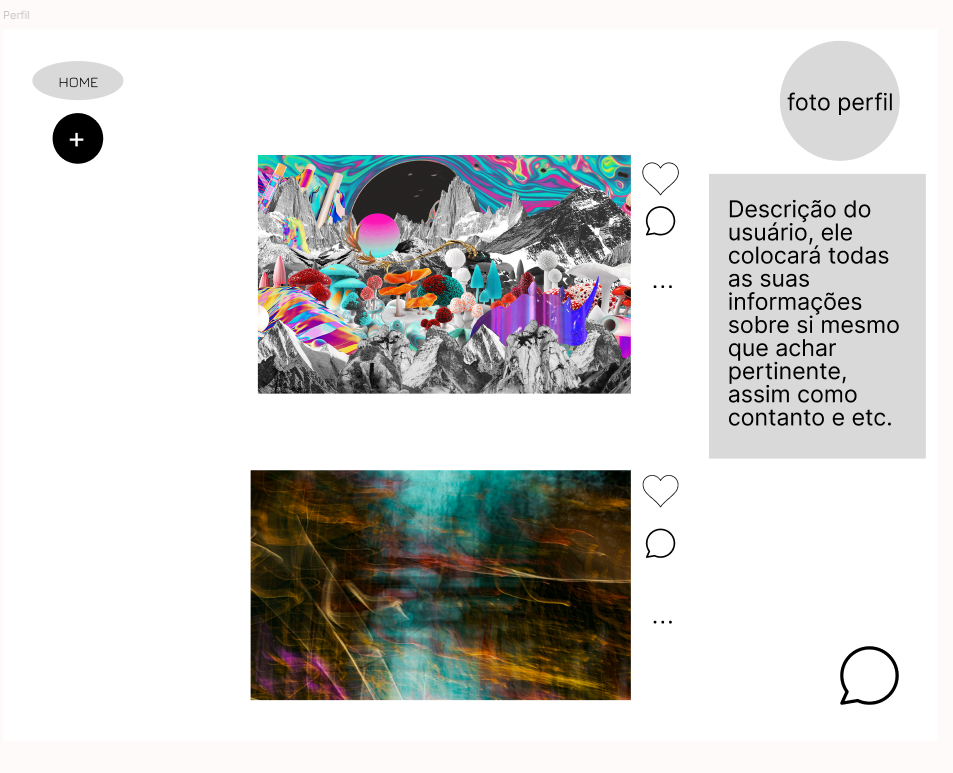

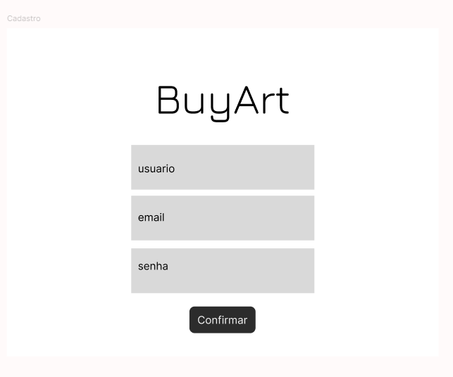
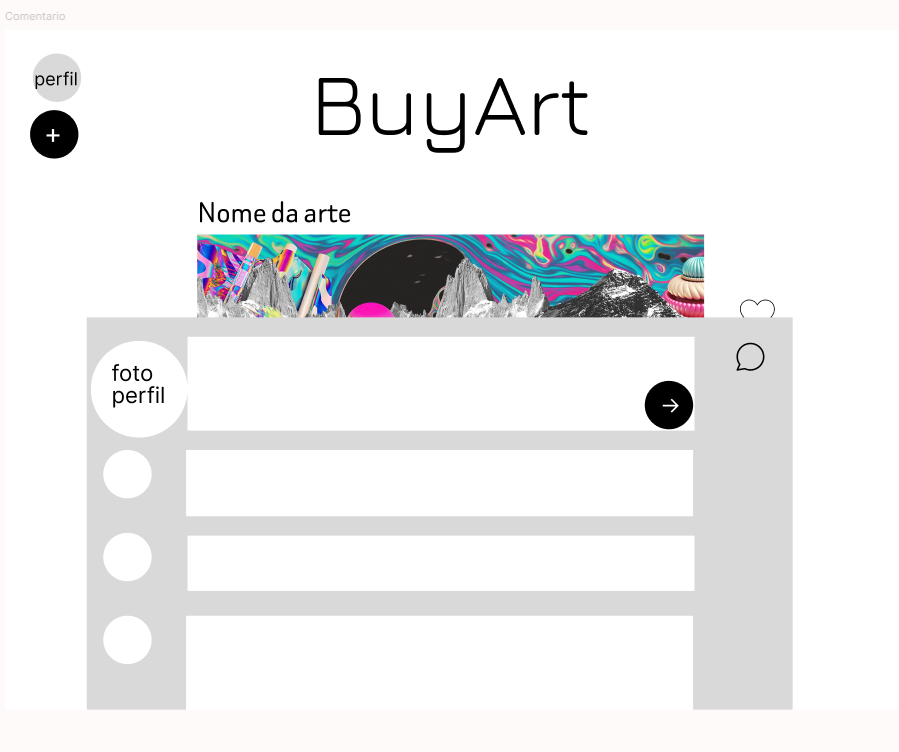

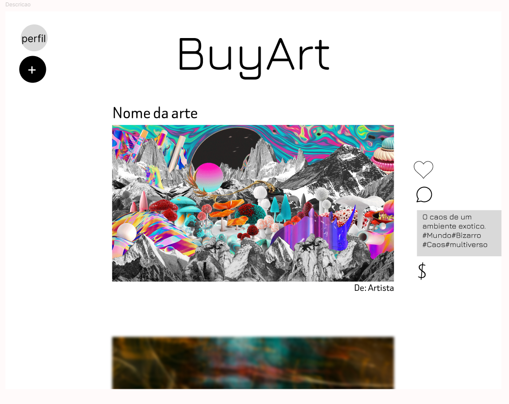
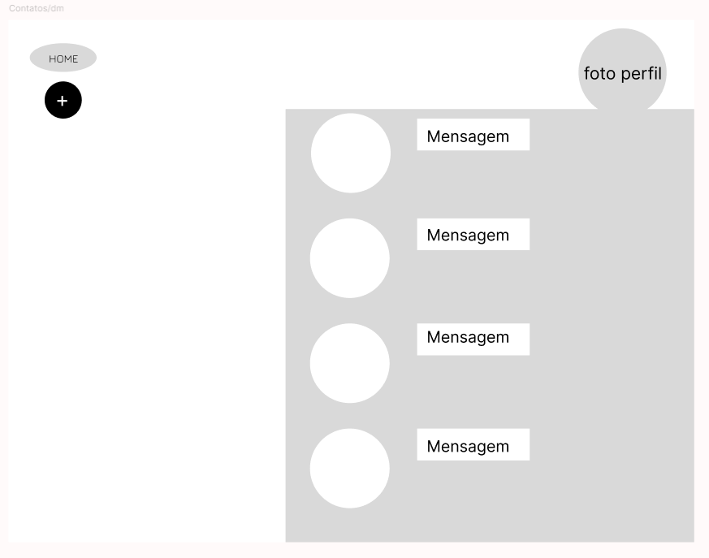
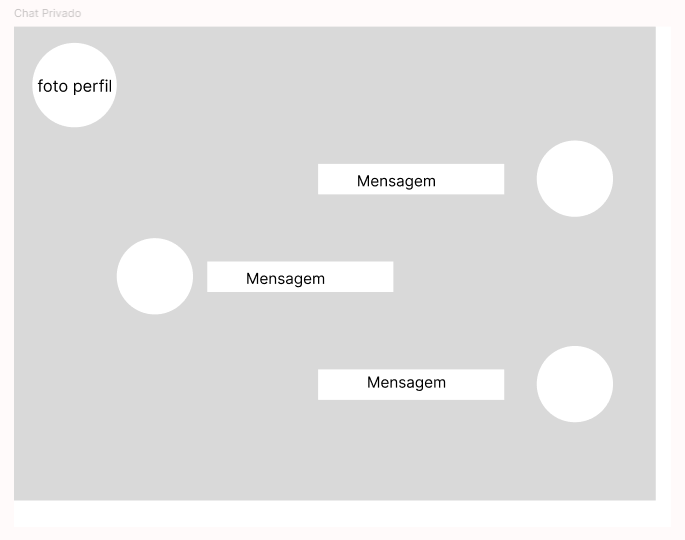

## Protótipo Interativo

✅ [Protótipo Interativo](https://www.figma.com/design/tIAitWKmroZEe3cb07LlNm/Raphael-Grossi's-team-library?node-id=0-1&t=9A7MVMKtCaBAggpd-1)

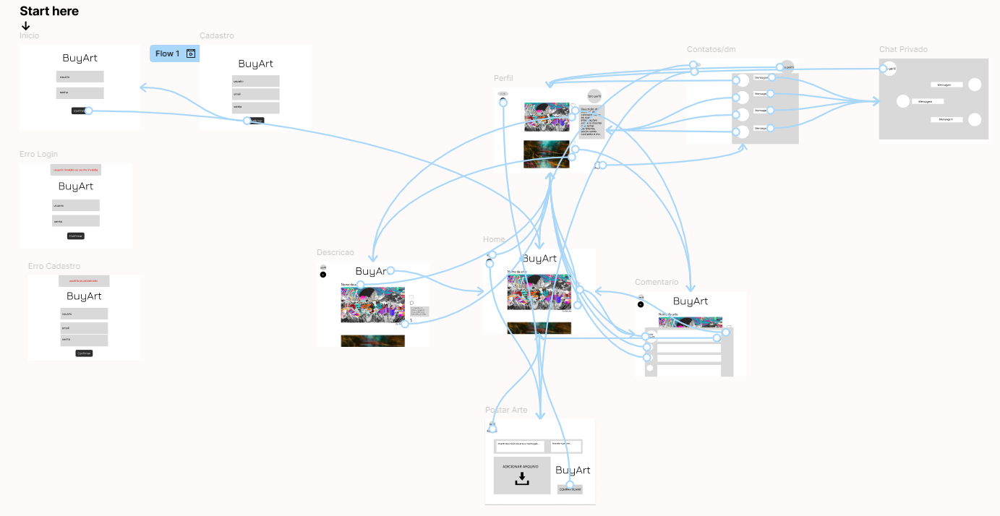

# Metodologia

Todos trabalharam construindo seus próprios artefatos e harmonizando para que o site funcionasse perfeitamente.

## Ferramentas

| Ambiente                    | Plataforma | Link de acesso                                     |
|-----------------------------|------------|--------------------------------------------------|
| Processo de Design Thinking | Miro       | [https://miro.com/app/board/uXjVL3cAQrQ=/?share_link_id=478612106930](https://miro.com/app/board/uXjVL3cAQrQ=/?share_link_id=478612106930) |
| Processo de Design Thinking | Miro       | [https://miro.com/app/board/uXjVKmJv9mY=/?share_link_id=822407940850](https://miro.com/app/board/uXjVKmJv9mY=/?share_link_id=822407940850) |
| Processo de Design Thinking | Miro       | [https://miro.com/app/board/uXjVKkYSgi4=/?share_link_id=870199955885](https://miro.com/app/board/uXjVKkYSgi4=/?share_link_id=870199955885) |
| Repositório de código       | GitHub     | [https://github.com/ICEI-PUC-Minas-CC-TI/pbh-cc-2024-2-ti1-ti-artes-digitais.git](https://github.com/ICEI-PUC-Minas-CC-TI/pbh-cc-2024-2-ti1-ti-artes-digitais.git) |
| Protótipo Interativo        | Figma      | [https://www.figma.com/design/tIAitWKmroZEe3cb07LlNm/Raphael-Grossi's-team-library?node-id=0-1&node-type=canvas&t=acsXNjZqIfqHriAk-0](https://www.figma.com/design/tIAitWKmroZEe3cb07LlNm/Raphael-Grossi's-team-library?node-id=0-1&node-type=canvas&t=acsXNjZqIfqHriAk-0) |

# Solução Implementada

## Vídeo do Projeto

✅ [Vídeo do Projeto](https://youtu.be/QY9w4Jug6VM)


## Funcionalidades

Esta seção apresenta as funcionalidades da solução.Info

Funcionalidade 1 - Cadastro de Contatos
Permite a inclusão, leitura, alteração e exclusão de contatos para o sistema

Estrutura de dados: Contatos
Instruções de acesso:dd
Abra o site e efetue o login
Acesse o menu principal e escolha a opção Cadastros
Em seguida, escolha a opção Contatos
Tela da funcionalidade:

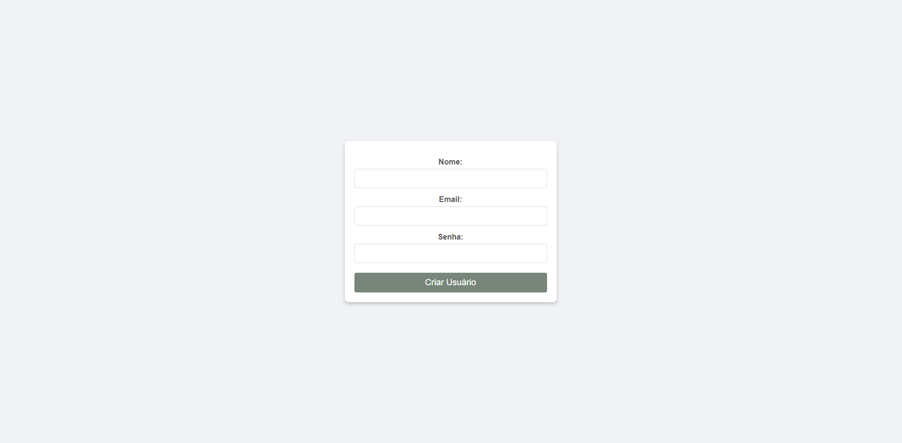

Funcionalidade 2 - Comentários
Permite a inclusão, leitura, alteração e exclusão de comentários para o sistema
Estrutura de dados: Comentários
Instruções de acesso:dd
Abra o site e efetue o login
Acesse o menu principal e clique no botão comentários
Em seguida, clique no botão enviar
Tela da funcionalidade:
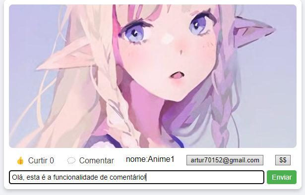

Funcionalidade 3 - Postar Imagens
Permite a inclusão, leitura, alteração e exclusão de imagens para o sistema
Estrutura de dados: Imagens
Instruções de acesso:dd
Abra o site e efetue o login
Acesse o menu principal e clique no perfil, depois clique em adicionar arte
Tela da funcionalidade:
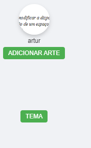

Funcionalidade 4 - Doação
Perimite doação de valores e escrever uma mensagem para o artista
Estrutura de dados: Doações
Instruções de acesso:dd
Abra o site e efetue o login
Acesse o menu principal e clique no botão que tem $$ como símbolo
Tela da funcionalidade:
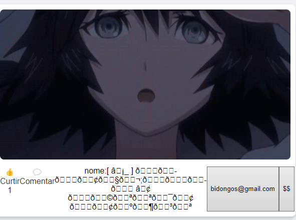

Funcionalidade 5 - Curtir
Permite curtir as imagens do sistema
Estrutura de dados: Curtidas
Instruções de acesso:dd
Abra o site e efetue o login
Acesse o menu principal e clique no perfil, depois clique em curtir
Tela da funcionalidade:
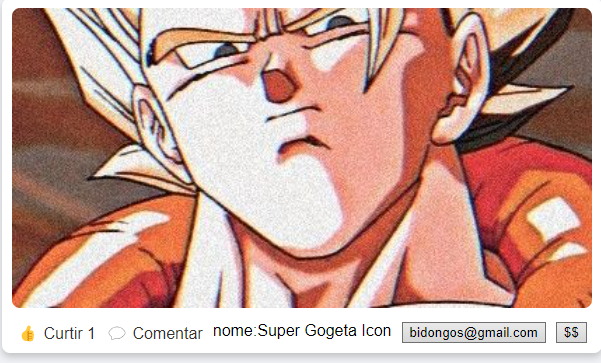

Funcionalidade 6 - Pesquisa
Permite a busca de imagens e artistas no sistema
Estrutura de dados: Busca
Instruções de acesso:dd
Abra o site e efetue o login
Acesse o menu principal e clique no campo de busca
Tela da funcionalidade:
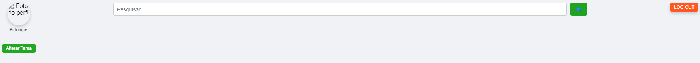

Funcionalidade 7 - Perfil
Permite a visualização do perfil do usuário
Estrutura de dados: Perfil
Instruções de acesso:dd
Abra o site e efetue o login
Acesse o menu principal e clique no perfil localizado no canto superior esquerdo da tela
Tela da funcionalidade:
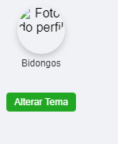

Funcionalidade 8 - Alterar Tema
Permite a alteração do tema do sistema
Estrutura de dados: Tema
Instruções de acesso:dd
Abra o site e efetue o login
Acesse o menu principal e clique no botão Alterar Tema localizado debaixo do perfil
Tela da funcionalidade:
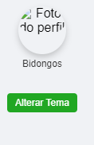

# Estruturas de Dados

Descrição das estruturas de dados utilizadas na solução com exemplos no formato JSON.

### Estrutura de Dados - Login/Cadastro

```json
{
  "usuarios": [
    {
      "id": 1,
      "login": "ceo",
      "senha": "Uryu1973",
      "nome": "uryu",
      "email": "hutao@gmail.com"
    },
    {
      "id": 2,
      "login": "ichigo",
      "senha": "ichigo928",
      "nome": "User Ichigo",
      "email": "bleach@gmail.com"
    },
    {
      "id": 3,
      "login": "kenpachi",
      "senha": "katana",
      "nome": "Zaraki",
      "email": "konpaku@gmail.com"
    }
  ]
}
```

# Referências

Pinterest, Instagram, Youtube, TikTok e ArtStation

